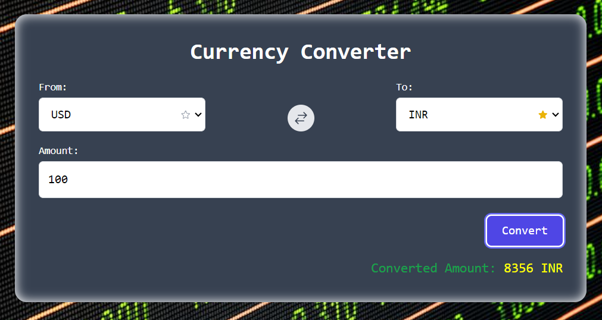
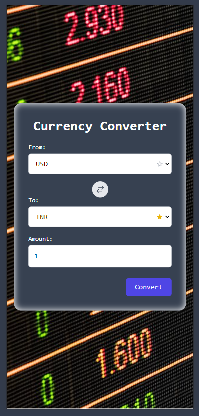
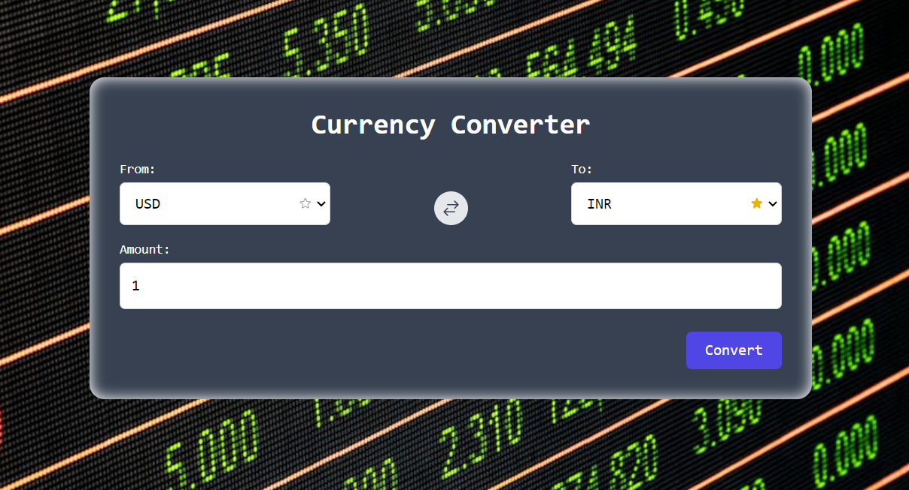

# Currency Converter
A responsive and user-friendly Currency Converter application built with React and styled using TailwindCSS. This application allows users to convert between different currencies and save their favorite currencies for quick access.

## Features

- Convert between multiple currencies.
- Add and remove favorite currencies.
- Swap the base and target currencies.
- Responsive design that works on all devices.

## Demo

You can view a live demo of the app: 

## Screenshots

## Technologies Used

- React
- TailwindCSS
- Javascript